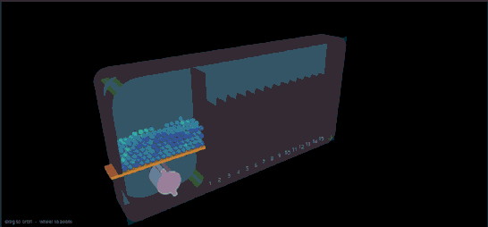
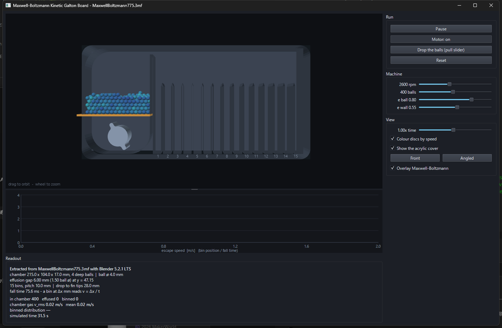
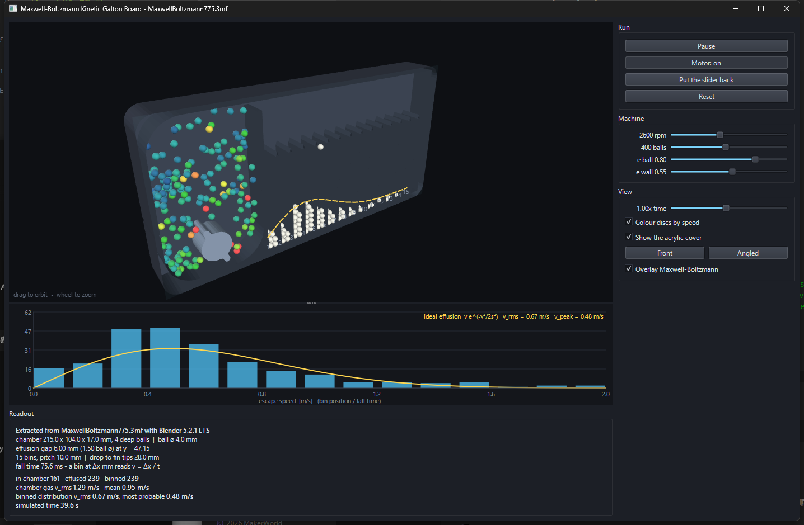
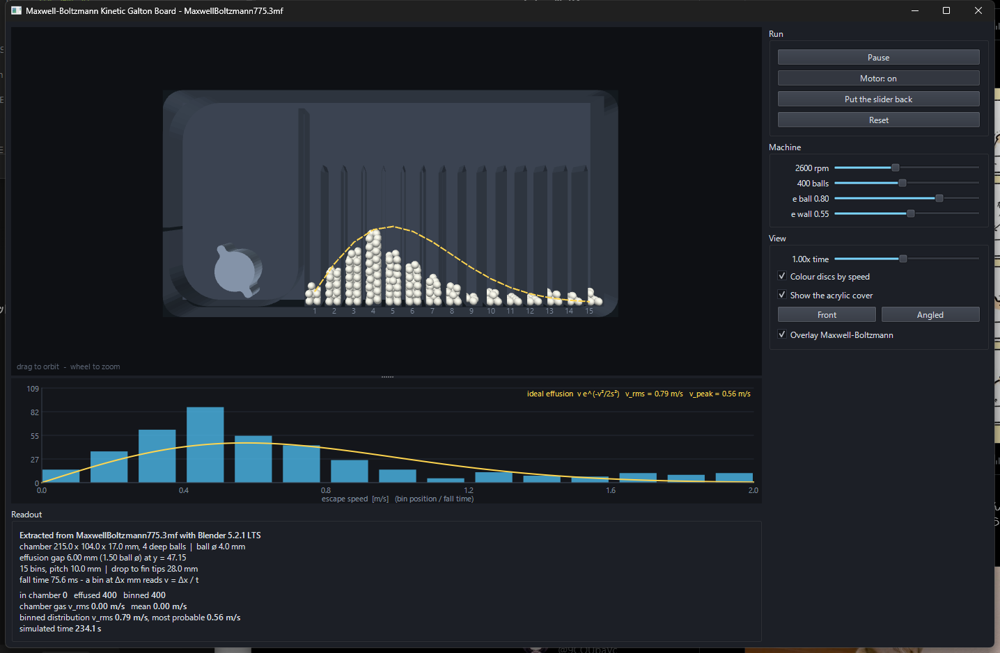
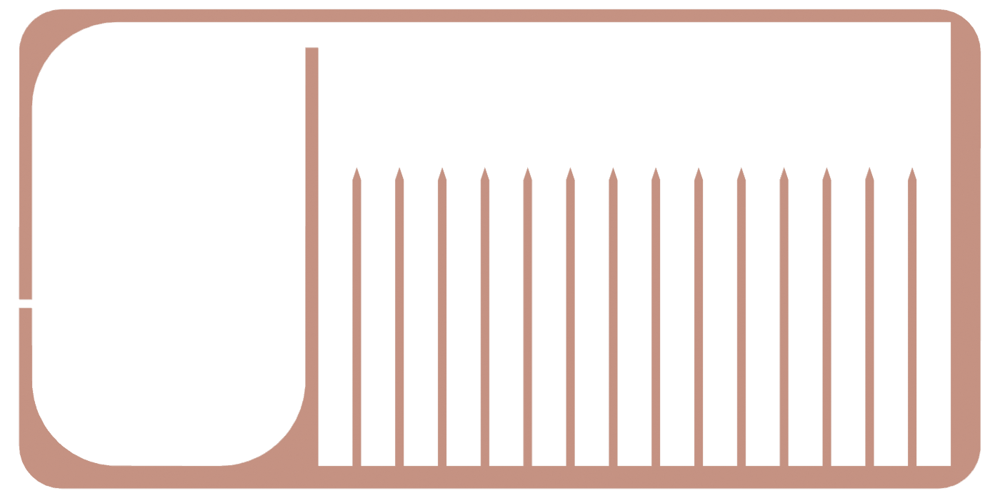

# Maxwell–Boltzmann Kinetic Galton Board — a Qt6/C++ simulator

A 3D rigid-sphere simulator of gao.lab's
[Maxwell Boltzmann Kinetic Galton Board](https://makerworld.com/en/models/2926630-maxwell-boltzmann-kinetic-galton-board),
running on the machine's **real dimensions** as taken from the printable 3MF.
It simulates the same **400 balls of 4 mm**, depth axis included.

None of those dimensions are typed in by hand: they are sliced out of
`MaxwellBoltzmann775.3mf` with Blender. The app itself never reads the 3MF.



| At startup (front) | Running (angled) |
|---|---|
|  |  |

---

## 1. What the machine shows

A classic Galton board — pegs and beads — traces a Gaussian. This one stacks up
a *speed distribution* instead.

| Part | Role |
|---|---|
| Left chamber | A two-finned rotor stirs the balls and pumps energy in. They collide with each other and thermalise: a gas in a box. |
| Gap at the top right | One ball wide (**6.0 mm** measured, for 4 mm balls). A ball leaving through it (**effusing**) has essentially no vertical velocity at that moment. |
| Bins | The fin tips sit **28.0 mm** below the gap, so the fall time `t = √(2h/g) = 75.6 ms` is the same for every ball. |

Because that fall time is constant, the horizontal distance `d = vₓ·t` is
**proportional to the horizontal speed at the moment of escape**. The bin number
*is* the speedometer.

### What a bin actually measures

A bin records only the **horizontal component vₓ** at escape — the out-of-plane
component never affects where a ball lands, in 2D or in 3D. The flux through the
gap is itself proportional to vₓ, so for an ideal gas the landing positions
follow

```
f(v) ∝ v · exp(−v² / 2σ²)          (a Rayleigh profile)
```

which is also the Maxwell–Boltzmann speed distribution of a two-dimensional gas.
The yellow curve in the app is that shape, with its width fitted from the second
moment of the histogram.

**The simulator's measurements do not match that ideal exactly.** Sweeping the
exponent `a` against 3 runs × 200 s × 400 balls (1190 landings in total):

| `f ∝ vᵃ·exp(−v²/2σ²)` | σ [m/s] | χ² (13 dof) |
|---|---|---|
| a = 0.5 | 0.66 | 332 |
| **a = 1 (Rayleigh / ideal)** | **0.57** | **811** |
| a = 1.5 | 0.51 | 1935 |
| a = 2 | 0.41 | 4283 |

The measured profile leans **towards the slow end and has a fatter fast tail**
than the ideal. There are two reasons, and the real machine should have both.

1. **The pile at low speed.** The divider is 3 mm thick, so as well as balls
   launched out of the gap there are balls that simply *roll over the lip*. They
   land in bins 1–2 with vₓ ≈ 0. Ideal effusion has no such population — its
   probability goes to zero as v → 0.
2. **The flat fast tail.** Balls that fly far bounce off the right wall and the
   fin tips and get redistributed into bins 12–15. The last bin also catches the
   overflow.

Driven granular gases are known to depart from a Maxwell distribution in the
first place, so this apparatus is better read as a *granular-gas speedometer*
than as a textbook ideal-gas figure. The overall shape — rise, peak, decay —
matches photographs of the real machine well.

That this departure is physics and not an implementation bug can be checked from
the headless output, which prints `predicted` (where the horizontal escape speed
says a ball should land) next to `landed` (where it actually did). When the two
have the same shape, nothing after the hole is wrecking the distribution.

All 400 balls binned, with the fitted curve over the histogram:



---

## 2. What was measured out of the 3MF

Output of `tools/build_geometry.ps1`. All in mm, origin at the centre of the
body, +Y up, +Z towards the viewer:

```
body            225.0 x 112.3 x 24.0 mm
interior        x[-109.50, 105.50]  y[-50.85, 53.15]
interior depth  z[-5.00, 12.00]  = 17.00 mm  (4.25 ball diameters)
divider         x[-45.50, -42.50]   top y = 47.15
effusion gap    6.00 mm  (1.50 ball diameters)
fins            14  pitch 10.00 mm  tip y = 19.15
bins            15  all 8.0 mm wide
drop height     28.00 mm
slider slot     y[-13.85, -11.85]
motor hole      centre (-77.50, -33.85)  r = 8.99
agitator        centre (-77.50, -33.85)  r_hub = 10.00  r_tip = 15.00
                height 15.50  ->  z[-5.00, 10.50]  (91% of the chamber depth)
```

### The interior is a pure extrusion

Going 3D stayed cheap because the tray is printed as an open box. Slicing it at
14 depths (z = −4.9 … 11.9) and comparing the measurements gives **exactly the
same numbers all the way through**:

```
      z    floor    ceil   leftW  rightW  divTop  finTop  #fins #bins        slot
   -4.9   -50.85   53.15 -109.50  105.50   47.15   19.15     14    15  [-13.85,-11.85]
    0.0   -50.85   53.15 -109.50  105.50   47.15   19.15     14    15  [-13.85,-11.85]
   11.9   -50.85   53.15 -109.50  105.50   47.15   19.15     14    15  [-13.85,-11.85]
```

So the walls, the divider and all fourteen fins are one 2D outline swept along
z. Collision detection applies the 2D outline test (158 edges) to a sphere's
(x, y), and the depth axis needs only two planes: the inner back face at z = −5
and the acrylic cover at z = +12. No 3D mesh test anywhere. The rotor is an
extrusion too.

### The rotor's depth has to be measured, not read off

The rotor was first placed using the 3MF's `source_offset_*` values. Those
record **where each part sat in the imported scene, not how the machine goes
together**. Taken literally in Z they bury 7.5 mm of the rotor inside a 7 mm
back plate, which cannot be:

- the motor hole in the back plate is **r = 8.99 mm** (for a 775 motor's pilot
  boss — the two r = 3.75 mm M4 holes 29 mm apart on either side agree)
- the rotor's outer radius is **10–12 mm or more over its whole 15.5 mm length**

The rotor cannot enter that hole, so it can only **stand on the inner back face
at z = −5**. The extractor therefore circle-fits the motor hole to get XY (which
lands exactly on the `source_offset` XY) and derives Z from the back face plus
the rotor's height. The result, z[−5.00, 10.50], is 91% of the chamber depth and
leaves 1.5 mm of clearance to the cover.

The extracted cross-section, rendered by Blender:



---

## 3. Building and running

You need **Qt 6.5 or newer** (Widgets / OpenGL / OpenGLWidgets), **CMake 3.21 or
newer**, a C++17 compiler and a GPU that can do **OpenGL 3.3 core**. Only
regenerating the geometry needs **Blender 4.x / 5.x** and **Python 3**.

The extracted `assets/geometry.json` is committed, so **you can clone, build and
run without the 3MF** — it is needed only to regenerate the shape (see
"Getting the 3MF" below).

On Windows the build script finds the MinGW kit, CMake and Ninja that ship with
the Qt installer:

```powershell
pwsh tools/build.ps1 -Run
```

With the presets, on any OS:

```bash
cmake --preset default -DCMAKE_PREFIX_PATH=/path/to/Qt/6.x.y/gcc_64
cmake --build --preset default
./build/default/KineticGaltonBoard
```

Plain CMake:

```powershell
cmake -S . -B build -G Ninja -DCMAKE_PREFIX_PATH=C:/Qt/6.11.1/mingw_64
cmake --build build
./build/KineticGaltonBoard.exe
```

`geometry.json` is baked into the binary as a resource, so the executable runs on
its own. An `assets/geometry.json` next to the executable (or one or two levels
above it) takes precedence, so a regenerated shape shows up without rebuilding.

### Getting the 3MF (only to regenerate the geometry)

The model is **CC BY-NC-SA 4.0**, so the 3MF itself is not redistributed here
(`.gitignore` excludes it). To regenerate:

1. Download the **Version for 775** 3MF from
   <https://makerworld.com/en/models/2926630-maxwell-boltzmann-kinetic-galton-board>
2. Put it in the repository root as `MaxwellBoltzmann775.3mf`

See [NOTICE.md](NOTICE.md) for the details.

### Regenerating the geometry

```powershell
pwsh tools/build_geometry.ps1
# if Blender is not in the usual place
pwsh tools/build_geometry.ps1 -Blender "D:\apps\blender\blender.exe"
```

### Headless mode (for checking the physics)

Runs the physics with no window and no OpenGL and prints the bin histogram.

```powershell
./build/KineticGaltonBoard.exe --headless 300 --rpm 2600 --balls 400
```

```
geometry   MaxwellBoltzmann775.3mf  bins=15  gap=6 mm  drop=28 mm  t_fall=75.5544 ms
interior   16.999 mm deep = 4 ball layers
run        200 s at 2600 rpm, 400 spheres
state      chamber=0  effused=400
walls      worst clearance 0 mm, spheres inside a wall by >0.1 mm: 0
at rest    0 spheres; beyond the rotor's disc 0, beyond its depth span 0
bins       400 spheres binned (left column = where the escape speed says it should land)
   1   0.05 m/s  predicted   18 █████                  | landed   33 █████████
   2   0.19 m/s  predicted   71 ██████████████████████ | landed   80 ██████████████████████
   3   0.32 m/s  predicted   44 █████████████          | landed   62 █████████████████
   4   0.45 m/s  predicted   34 ██████████             | landed   52 ██████████████
   ...
```

There are three self-checks in that output.

- `walls` — whether any sphere has ended up inside a wall. Healthy runs show a
  clearance of essentially 0 (numerical noise only).
- `at rest` — of the spheres that have stopped, how many are outside the rotor's
  swept disc or its depth span. With the correct depth (91%) all 400 effuse and
  this reads 0. Back when the depth was wrongly taken as 8 mm, a few were left
  stranded at the bottom of the right-hand fillet (x ≈ −65.6, which is 19.2 mm
  from the axis and so outside the 17 mm sweep).
- `predicted` vs `landed` — as described in section 1.

---

## 4. Using it

1. On startup the 400 balls rest on the slider, as they do in the real machine.
2. Leave **Motor: on** and press **Drop the balls (pull slider)**. That is the
   order the model's instructions insist on: spin the rotor up first, then drop
   the balls onto it, or the motor stalls.
3. The balls are stirred in the chamber, effuse through the gap and pile up in
   the bins on the right. Getting 90% of them across takes four to five minutes
   of simulated time.
4. The dashed yellow line is the ideal effusion curve, width-fitted to the
   histogram so far (section 1).

| Control | Effect |
|---|---|
| Drag in the view | Orbit the camera |
| Wheel | Zoom |
| Front / Angled | Camera presets; Front matches the photographs of the real machine |
| rpm | Rotor speed, which sets the system's "temperature". Too low and nothing effuses; too high and the distribution piles up against the last bin |
| balls | Ball count. 400 by default, as in the real machine. Range 50–800 |
| e ball / e wall | Restitution. More dissipation means a colder gas |
| 1.00x time | Time scale |
| Colour discs by speed | Faster balls are redder — you can watch the distribution form inside the chamber |
| Show the acrylic cover | Draw the front cover as a faint veil |

---

## 5. Layout

```
CMakeLists.txt              build definition
CMakePresets.json           configure/build presets
LICENSE                     MIT, for the code
NOTICE.md                   provenance of the model and the CC BY-NC-SA terms
MaxwellBoltzmann775.3mf     input; not redistributed, not tracked
assets/
  geometry.json             the extraction result - all the app reads (CC BY-NC-SA)
  assets.qrc                resource definition, baked into the executable
src/
  main.cpp                  entry point and --headless mode
  Geometry.*                reads geometry.json
  Simulation.*              3D rigid-body solver
  BoardGLView.*             OpenGL 3.3 view, orbit and zoom
  DistributionView.*        histogram and theory curve (QPainter)
  MainWindow.*              UI
tools/
  extract_3mf.py            3MF -> STL, plus each part's assembly offset
  blender_extract.py        runs inside Blender: cross-sections and measurement
  build_geometry.ps1        runs the two above end to end
  build.ps1                 finds Qt, then configures and builds
docs/                       images for this README (generated, but tracked)
build/                      build output (not tracked)
build_assets/               intermediate STLs (not tracked)
```

### How the geometry is extracted

1. `extract_3mf.py` opens the 3MF (a zip) and writes each
   `3D/Objects/object_*.model` mesh out as a binary STL. It also reads
   `source_offset_*` from `Metadata/model_settings.config` to get each part's
   position relative to the body (agitator = `(-77.50, -33.85, -4.75)`).
2. `blender_extract.py` runs under Blender's `-b -P` and
   - cuts the body at `z = 0` (mid-depth of the tray) with
     `bmesh.ops.bisect_plane`
   - walks the cut edges into closed loops and decimates them with
     Douglas–Peucker at 0.08 mm
   - fires **horizontal and vertical raycasts** at the resulting outline to
     measure the floor, ceiling, side walls, the divider and its tip, the fin
     positions and tips, the bin boundaries and the slider slot
   - finds the inner back face along the depth axis by bisecting for the height
     at which the cross-section stops covering the whole footprint
     (→ `interior_z`)
   - cuts the agitator the same way for the rotor profile (hub r = 10, fin tips
     r = 15). Its placement comes from circle-fitting the motor hole for XY and
     from the back face plus the rotor height for Z — *not* from
     `source_offset`'s Z, for the reason given in section 2.
3. The result is written to `assets/geometry.json`.

So every dimension comes from the actual mesh; nothing is hard-coded. The one
exception is the 4 mm ball diameter, taken from the model description
("They are 4 mm diameter").

### Rendering

No 3D mesh is loaded from the 3MF either. The extracted 2D outline is swept
along the depth axis and the shell is assembled on the fly (body = the outline's
side faces plus the inner back face; rotor = the profile's side faces plus end
caps). The balls are one icosphere drawn 400 times with instancing. Only the bin
numbers and the theory curve are projected through the same MVP matrix and drawn
over the top with QPainter.

---

## 6. The physics model, and how it differs from the real machine

- **Fixed timestep** of 1/2000 s, sequential impulses. There are four kinds of
  contact: static segments (the extruded 158-edge outline), the inner back face
  and cover, sphere–sphere, and the spinning rotor. Sphere–sphere broad phase
  uses a 3D uniform grid. With 400 spheres, headless runs at about 1.9× real
  time and the GUI at roughly real time.
- **The rotor is kinematic** — infinite mass, constant angular velocity. A real
  motor bogs down under load; this one does not.
- **Speed is capped at 6 m/s.** A kinematic rotor would otherwise pump a sphere
  trapped against a wall without limit. The real machine would jam, so the cap
  stands in for that. It also keeps one substep's travel well under the 2 mm
  thickness of a fin.
- **Nothing leaves the box.** As a backstop against contact resolution pushing a
  sphere through a wall, positions are clamped to the interior AABB.
- No rolling friction, no ball spin, no air drag. Tangential damping
  (`tangentFriction`) stands in for all of it. Without spin the balls slide more
  easily along walls than real ones would.
- **Wall contacts** are resolved against the nearest *feature* of the extruded
  2D outline. So that a sphere whose centre has ended up inside the material can
  still be pushed back out correctly, every edge carries an outward normal and
  every vertex carries a **pseudonormal** (the normalised sum of its two adjacent
  edge normals). The vertex pseudonormal is essential: without it a sphere
  passing just outside a sharp convex vertex — every fin ends in one — is
  misread as being inside the material and kicked sideways.
- The "temperature" is a free parameter set by rpm and restitution. The default
  of 2600 rpm was chosen so the distribution fits across the 15 bins.
- The departure from the ideal profile is covered in section 1.

---

## 7. Licence

| What | Licence |
|---|---|
| `src/`, `tools/`, `CMakeLists.txt`, `CMakePresets.json` | **MIT** ([LICENSE](LICENSE)) |
| `assets/geometry.json`, the images in `docs/` | **CC BY-NC-SA 4.0** © gao.lab (derived from the model) |
| `MaxwellBoltzmann775.3mf` | © gao.lab, CC BY-NC-SA 4.0 — **not included in this repository** |

The machine's shape comes from
[Maxwell Boltzmann Kinetic Galton Board](https://makerworld.com/en/models/2926630-maxwell-boltzmann-kinetic-galton-board)
by gao.lab. `assets/geometry.json` is a derivative of it, so **an executable
built with it embedded also carries the NonCommercial and ShareAlike terms** —
it cannot be used commercially. See [NOTICE.md](NOTICE.md) for the details.
